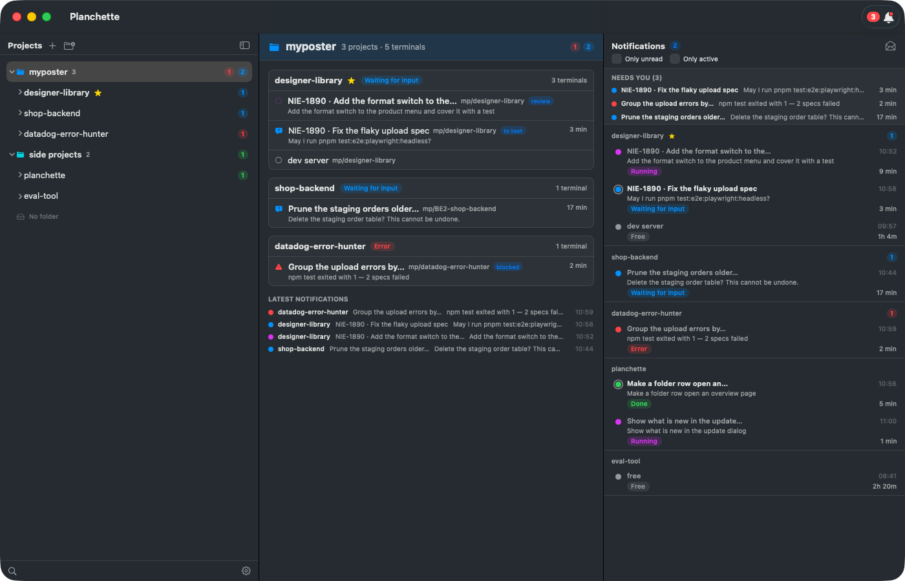
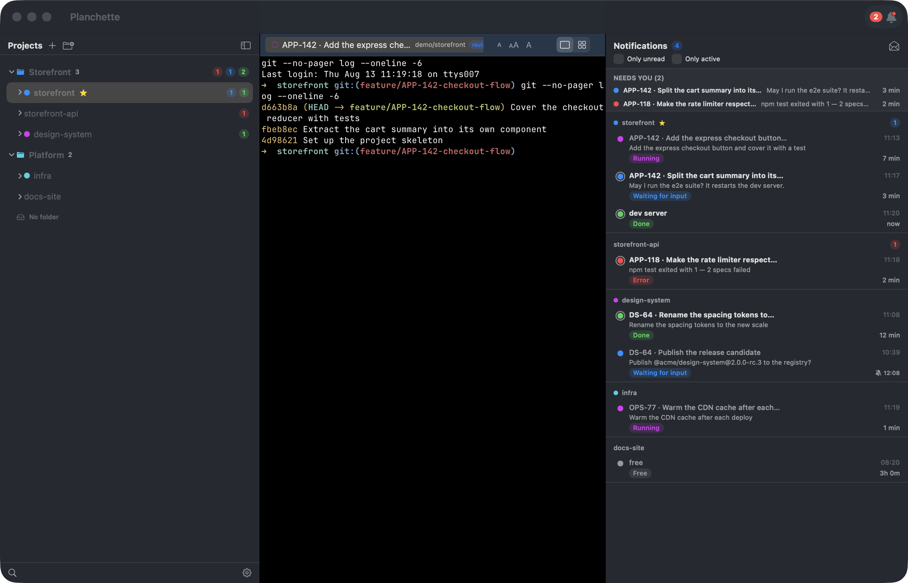
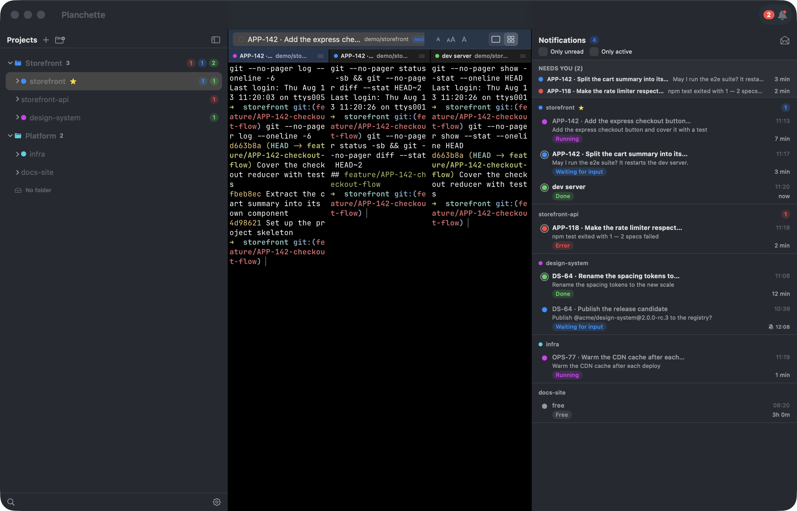

# Planchette 🔮

> Run many AI coding agents at once and always know which one needs you.

A native macOS terminal built on [Ghostty](https://ghostty.org) (libghostty).
Terminals are grouped into projects, projects into folders, and every terminal
carries a state: **running · waiting · error · done · free**. Layouts survive
restarts and reboots.



## Install

macOS 14+, Apple Silicon or Intel.

```sh
curl -fsSL https://raw.githubusercontent.com/marcello-a/Planchette/main/scripts/install.sh | sh
```

Verifies the download against the release's `SHA256SUMS`, installs to
`/Applications`, clears the quarantine flag. ~70 lines, read it first if you like:
[`scripts/install.sh`](scripts/install.sh).

```sh
sh install.sh 0.2.18                          # pin a version
PLANCHETTE_DEST=~/Applications sh install.sh  # install elsewhere
```

Or grab `Planchette.dmg` from the [latest release](https://github.com/marcello-a/Planchette/releases/latest).
Updates come in-app afterwards (**Install & Relaunch**, or staged until you quit).

<details>
<summary><b>"Apple could not verify Planchette is free of malware"</b></summary>

Expected — the app is ad-hoc signed, not notarized (that needs a paid Developer
ID). The install script above clears the flag for you. By hand:

```sh
xattr -dr com.apple.quarantine /Applications/Planchette.app
```

Or *System Settings → Privacy & Security → Open Anyway* after the first blocked
launch. On macOS 14, right-click the app → *Open*.
</details>

## Features

**Attention**
- States come from agent hooks: running / waiting / error / done / free
- Screen fallback every 1.5s when hooks stay silent — rules in editable JSON
- Notifications panel: "Needs you" first, errors before questions, oldest first
- Read/unread per report, with an *Only unread* filter
- Menu-bar + dock badges, ⌘⇧K jumps to the most urgent waiting terminal
- Snooze a terminal or a project (1h / 2h / tomorrow 9:00), reminder on expiry

**Organising work**
- Projects in folders; drag one into a folder and drop it into an exact slot
- Click a folder for an overview: every project, its state, its terminals
- Tab view or cluster grid per project; drag panes to split
- Terminals name themselves: `APP-142 · Add the express checkout button`
- Tags, colors, favorites, multi-select (⌘/⇧-click) for batch actions
- Quick switcher ⌘K over title / path / branch / tags
- Multiple windows, and merging them back
- Saved arrangements — rebuild a whole workspace in one click

**Terminals**
- Persistence across restart and reboot, incl. `claude --resume` and startup commands
- Durable terminals (opt-in, needs tmux): agents survive quit, crash and update
- Git worktrees as projects (⌘⇧T), with cleanup on close
- Drop a screenshot onto a Claude terminal → pasted as an image, not a path
- Import open cwds from iTerm2 / Terminal.app, or drop a folder from Finder
- 7 UI languages, light/dark/system

**For agents**
- Socket API + `planchette` CLI in every terminal: list, open, prompt, wait, read,
  and `notification list` — the notifications panel as JSON for anything else you
  want to show it in ([manual](docs/API.md))
- So an agent can start a reviewer beside itself and block on its verdict
  ([skill](skills/planchette/SKILL.md))
- Optional AI assist: one-line summaries per session via headless `claude -p`

### One project at a time, or all of it at once




## Develop

```sh
# once: build GhosttyKit from the pinned submodule (needs Zig in .tooling/)
cd vendor/ghostty && ../../.tooling/zig/zig build -Demit-macos-app=false \
  -Dxcframework-target=native -Doptimize=ReleaseFast && cd ../..
cp -R vendor/ghostty/macos/GhosttyKit.xcframework macos/Planchette/

cd macos/Planchette
swift test
swift build && GHOSTTY_RESOURCES_DIR=$PWD/../../vendor/ghostty/zig-out/share/ghostty \
  ./.build/debug/Planchette
```

```sh
sh scripts/package.sh          # → dist/Planchette.{app,dmg,zip}
sh scripts/release.sh 0.2.19   # tag, build, publish a GitHub release
```

Run a second instance without touching your workspace — `$HOME` does **not**
isolate it, this does:

```sh
PLANCHETTE_STATE_DIR=/tmp/demo /Applications/Planchette.app/Contents/MacOS/Planchette
```

Fire a hook by hand to watch a terminal change state:

```sh
echo '{"hook_event_name":"Notification","message":"needs permission"}' \
  | PLANCHETTE_SESSION=<terminal-uuid> hook/planchette-hook
```

| Where | What |
|---|---|
| `macos/Planchette` | the app (Swift/SwiftUI) |
| `hook/` | `planchette-hook`, forwards Claude Code hook events to the socket |
| `scripts/` | install, package, release |
| `skills/` | the planchette skill for agents |
| `docs/` | concept, architecture, the API manual |
| `core/`, `linux/` | reserved for the shared Zig core and a GTK4 app — empty |

## Docs

[CONCEPT](docs/CONCEPT.md) · [ARCHITECTURE](docs/ARCHITECTURE.md) ·
[API](docs/API.md) · [CONTRIBUTING](CONTRIBUTING.md) · [AGENTS](AGENTS.md) ·
[CHANGELOG](CHANGELOG.md)

## Status

macOS ships and updates itself. Linux is planned, not started — `core/` and
`linux/` are empty.

---

*A planchette is the pointer on a Ouija board: in a séance with many spirits, it
moves to the one that has something to say.*

MIT
